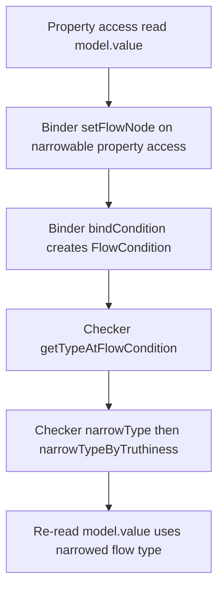
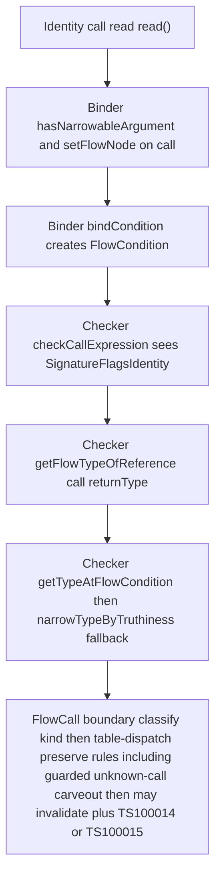
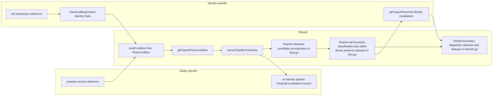

# Identity CFA Phase 1

## Executive Summary
This PR covers Phase 1 implementation for identity-call CFA behavior.

In scope now:
- `identity` parsing/binding and call-shaped narrowing integration
- conservative uncertainty-boundary invalidation with guarded preserves
- parity visibility sweeps and divergence tracking

Out of scope now:
- explicit `mutator`/`links` contracts
- ambiguity diagnostics for unresolved multi-endpoint impacts
- constrained-overload post-call narrowing from explicit contracts

## Current Implementation Status
- Implemented-shape parity (sweep): `9/9`
- Missing getter-origin matrix: `5/6` matched (`M6` remains conservative)
- Latest full validation: green (`npx hereby build`, `npx hereby test`, `npx hereby lint`, `npx hereby format`)

M6 closure attempt status (2026-03-10):
- Attempted narrow checker preserve for ambient no-arg unknown calls crossing ambient nullable identity reads.
- Result: `M6` closes locally, but non-target conservative boundary behavior regressed (`identityModifierBoundaries.ts` baseline drift).
- Decision: do not ship this rule in Phase 1; keep `M6` as the explicit residual mismatch.

High-signal delivered slices:
- parser/binder support for `identity` in declaration type positions
- repeated-read identity narrowing in covered local-flow patterns
- uncertainty-boundary invalidation slices (unknown call/callback/await/alias forms per covered matrix)
- Tier 1 write-form invalidation expansion (compound/logical/unary endpoint mutations)
- narrow Tier 2 passthrough preserves with strict local guards

## Phase Implementation Plan (Committed Order)

### Master Plan
| Phase | Objective | Deliverables | Entry criteria | Exit criteria | Dependencies | Status |
| --- | --- | --- | --- | --- | --- | --- |
| 1 | Identity core + conservative safety baseline | `identity` parse/bind; repeated-read narrowing; initial uncertainty boundaries; Tier 1 core write invalidation; uncertainty diagnostics (`TS100014`/`TS100015`) | SDD + TDD plan established | Full validation green; parity sweep tracked; missing matrix reported | parser/binder/checker alignment | In progress (major slices landed) |
| 2 | Parity breadth expansion | callback parity breadth; Tier 1 write-form breadth expansion; Tier 2 guarded forwarding expansion; additional getter-origin mapping | Phase 1 stable and green | Added slices green with negative controls and no broad regressions | Phase 1 boundary classifier + diagnostics | Planned |
| 3 | Guarded precision hardening | deeper callback/forwarding families under strict proofs; expanded conservative/non-goal matrix | Phase 2 slices stable | Precision gains land with soundness guardrails intact | Tier 2 matcher and alias-proofing infrastructure | Planned |
| 4 | Stabilization + perf guardrails | regression sweeps; perf trend checks; conservative-gap documentation refresh | Phase 1-3 feature set stabilized | repeated green validation and stable perf envelope | benchmark harness + full suite coverage | Planned |
| 5 (Final) | Explicit-contract stage | `mutator`/`links` fallback resolution; multi-endpoint ambiguity diagnostics; constrained-overload post-call narrowing with explicit unique links | prior phases stable and gaps justify explicit contracts | explicit-contract tests green and soundness constraints met | parser+binder+checker contract pipeline | Planned (out of scope for this PR) |

### Phase Deliverables (Concrete)
| Phase | Deliverables in committed order | Status |
| --- | --- | --- |
| 1 | 1) `identity` parse/bind support. 2) repeated-read narrowing. 3) uncertainty boundaries + diagnostics. 4) Tier 1 write invalidation local slices. 5) guarded narrow parity preserves. 6) parity/corpus/missing-matrix visibility suites. | Partial complete |
| 2 | 1) callback breadth parity slices. 2) write-form matrix breadth. 3) Tier 2 guarded forwarding breadth. 4) submodule parity expansion slices. | Not started |
| 3 | 1) deeper guarded forwarding/callback families. 2) refined conservative gates and additional negative controls. | Not started |
| 4 | 1) stabilization/refactor sweeps. 2) perf guardrail verification on checker microbench and workload snapshots. | Not started |
| 5 | 1) explicit contract parser/binder. 2) checker fallback resolution. 3) ambiguity diagnostics. 4) constrained-overload linked post-call narrowing. | Not started |

## Parity Status And Divergences
Visible parity summary:
- matched sweep categories: `9/9`
- missing getter-origin matrix: `5/6` matched, `M6` divergence retained and documented

Top divergences to track:
- `M6` conformance-style unknown-call contrast remains conservative on identity path (`TS100015` + assignment error)
- callback const no-op alias (`const cb = () => {}; invoke(cb)`) remains conservative in current baselines
- broader Tier 2 non-trivial or mutable forwarding remains conservative by design

## Benchmarks / Perf
- checker microbench harness: `internal/checker/identity_bench_test.go`
- benchmark command: `go test ./internal/checker -run '^$' -bench BenchmarkIdentityCFAFlow -benchmem -count=1`
- TS-main snapshot: historical only (2026-03-10); see latest benchmark section below
- branch-vs-main latest snapshot (2026-03-10 refresh): wall `+1.81%`, RSS `+5.43%`

## Design Decisions And Re-review Outcomes
- naming: keep `identity` for continuity in Phase 1; revisit at explicit upstream checkpoint
- conservative core retained as default safety contract
- guarded preserves allowed only for strict tested shapes
- broad carveouts deferred until negative controls + perf evidence

## Detailed Matrices And Appendices
All previously existing detailed content is preserved below and treated as appendices/source material.

## Scope
This PR covers Phase 1 only: `identity` support and heuristic uncertainty-boundary invalidation slices.
It does not include the final phase explicit contracts (`mutator`/`links`).

## Naming Decision
Decision applied from swarm review:
- Keep `identity` for this proposal in Phase 1 and current upstream discussion continuity.
- Defer rename debate to an explicit upstream naming checkpoint.

Candidates considered:

| Candidate | Pros | Cons |
| --- | --- | --- |
| `identity` | Already used by the active proposal/discussion; stable continuity across issues/docs/tests; minimizes churn during Phase 1 | Can be confused with the identity-function idiom (`x => x`); less immediately intuitive for some users |
| `stable` | Intuitive for "repeated-read stability"; precedent in broader ecosystem terminology | Can imply stronger global immutability than intended local-flow guarantee; deviates from current proposal naming |
| `getter` | Very direct to callable-getter mental model; easy onboarding | Overlaps with existing property-getter terminology and can blur callable-vs-property semantics |
| `pure` | Familiar term in PL literature; suggests deterministic behavior | Semantically too strong for this feature (implies side-effect constraints beyond intended CFA contract) |
| `readonly`/`const` | Familiar TypeScript keywords | Already heavily loaded with other meanings; high confusion risk |
| `cached`/`memo` | Suggests repeated reads are stable | Implies runtime implementation details not required by this type-system feature |

Timing rationale:
- Phase 1 is focused on CFA behavior slices and parity/stability evidence.
- Renaming now would create documentation/test churn without improving behavior correctness.
- Keeping the existing token preserves comparability with upstream issue threads and interim baselines.

Reevaluation trigger:
- Revisit naming only at an explicit upstream checkpoint (design discussion or proposal advancement gate) after Phase 1 evidence is collected.
- Trigger inputs should include: ambiguity reports from reviewers/users, diagnostic clarity feedback, and interoperability with final-phase explicit-contract terminology.

Decision for constrained-overload post-call narrowing:
- Not part of Phase 1 runtime behavior.
- Treated as final-phase behavior because it depends on explicit contract resolution (`mutator`/`links`) and unambiguous endpoint linkage.

## Reordered Phase Roadmap (Impact First)
Ordering principle:
- Ship highest-impact behavior that does not require explicit contracts first.
- Pull write behavior and getter/setter parity forward.
- Keep explicit `mutator`/`links` as the final phase.

| Phase | Primary goals | Impact | Implementation complexity | Dependency on explicit contracts (yes/no) |
| --- | --- | --- | --- | --- |
| 1 | Identity read reuse, Tier 1 write invalidation core, uncertainty-boundary baseline | High | Medium | No |
| 2 | Getter/setter parity sweep and write-form parity expansion | High | Medium | No |
| 3 | Tier 2 guarded precision expansion and heuristic diagnostics hardening | Medium-High | High | No |
| 4 | Stabilization: regression sweep, perf guardrails, conservative-gap documentation | Medium | Medium | No |
| 5 (Final) | Explicit `mutator`/`links`, ambiguity diagnostics, constrained-overload post-call narrowing | High (targeted hard cases) | High | Yes |

### Impact vs Effort Rationale
- Phase 1 first: core narrowing plus write/boundary invalidation removes the biggest day-to-day friction with bounded checker changes.
- Phase 2 early: parity-first write scenarios provide visible user impact and fast validation against getter/setter behavior.
- Phase 3 after parity core: Tier 2 improvements are valuable but trickier; they should build on proven conservative defaults.
- Phase 4 before contracts: lock in refactor stability and performance before adding metadata-driven complexity.
- Phase 5 last: explicit contracts solve remaining ambiguous/multi-endpoint cases, but they require parser/binder/checker coordination and have the highest integration risk.

## References
- `docs/identity-modifier-spec.md`
- `docs/identity-heuristic-tdd-plan.md`
- `testdata/tests/cases/compiler/identityModifierParity.ts`
- `testdata/tests/cases/compiler/identityModifierTier1Writes.ts`
- `testdata/tests/cases/compiler/identityModifierGetterParitySweep.ts`
- `testdata/tests/cases/compiler/identityModifierGetterCorpus.ts`
- `testdata/tests/cases/compiler/identityModifierGetterMissingMatrix.ts`
- `testdata/tests/cases/compiler/identityModifierHeuristicDiagnostics.ts`
- `testdata/tests/cases/compiler/identityModifierP8Conservative.ts`

## Design Re-Review Outcome
Multi-perspective design re-review outcome:
- Keep the Phase 1 conservative core unchanged as the default safety contract.
- Keep only strict, shape-guarded heuristic parity preserves already supported by tests.
- Freeze broad new carveouts until negative controls and perf evidence are present.

Dual parity metrics (reported separately):
- Implemented-shape parity metric: `9/9` categories matched in `identityModifierGetterParitySweep.ts` for currently implemented guarded shapes.
- Corpus parity and refactor-stability metric: broad corpus remains visibility-first; residual conservative deltas are allowed while preserving checker stability and avoiding broad unsound relaxations.
- Missing getter-origin matrix metric: `5/6` matched in `identityModifierGetterMissingMatrix.ts`; the remaining `M6` conformance-style unknown-call boundary contrast is retained as an explicit conservative delta (`TS100015` + assignment error on identity path).
- Latest M6 attempt outcome: an ambient nullable unknown-call preserve candidate was evaluated and rejected because it changed non-target conservative behavior; matrix remains `5/6` until a stricter isolating rule is proven.

Known heuristic preserves (currently retained):
- Same-receiver `read()` then `set(non-nullish)` narrow write-preserve slice.
- Narrow unknown-call preserve for guarded ambient no-arg `void` expression-statement calls.
- Narrow await preserve for expression-statement `await Promise.resolve()` and ambient no-arg await nullish-read slice.
- Narrow Tier 2 local trivial passthrough preserves (inline passthrough, local const/function helper passthrough, strict local alias chain passthrough).
- Direct const alias preserve (`const alias = read`).

Soundness-risk preserves kept conservative or deferred:
- Callback alias preserve (`const cb = () => {}; invoke(cb);`) remains conservative in current baselines.
- Mutable/reassigned helper identifiers and mutable alias-chain forwarding remain conservative.
- Consumer-style forwarding (`useReader(pass(read))`) remains conservative.
- Non-trivial helper bodies remain conservative.
- Dynamic/non-literal write shapes and broader receiver-alias write paths remain conservative.

## Phase 1 Design Modifications
- [x] Reframe parity reporting into two independent metrics: implemented-shape parity and corpus parity/refactor-stability.
- [x] Add explicit missing-matrix reporting (`5/6` matched, `M6` residual) so parity interpretation does not hide conformance-style unknown-call boundary deltas.
- [x] Preserve strict uncertainty-boundary defaults; only keep narrow preserves with explicit guard conditions.
- [x] Document retained preserves vs intentionally conservative non-goals in this PR description.
- [x] Align SDD with explicit normative split between conservative core and guarded parity-preserve layer.
- [x] Align TDD plan with invariant ledger and gate criteria for future carveouts.
- [ ] Expand callback alias parity only after mandatory negative controls and perf checks pass.
- [ ] Expand Tier 2 beyond trivial passthrough only behind invariant and gate compliance.

## Can identity use getter flow line directly?
- Short answer: no, not fully in current architecture.
- Why: both paths share CFA infrastructure (same flow graph, same `getTypeAtFlowCondition` narrowing engine), but they enter it through different reference shapes and boundary handling.

Shared path (same line):
- Binder emits flow conditions via `bindCondition` in `internal/binder/binder.go`.
- Checker narrows in `getTypeAtFlowCondition` -> `narrowType` in `internal/checker/flow.go`.
- Truthiness narrowing uses `narrowTypeByTruthiness` for both property and call-shaped references.

Divergence points (current code):
- Reference shape:
  - Getter path is property/element access references via `isNarrowableReference` and `setFlowNode` on `KindPropertyAccessExpression`/`KindElementAccessExpression` (`internal/binder/binder.go`).
  - Identity path is zero-arg call references enabled by `isNarrowableReference` -> `hasNarrowableArgument`, plus `setFlowNode` on `KindCallExpression` (`internal/binder/binder.go`).
- Read typing entry:
  - Getter path follows normal property access checking and then flow lookup for that access reference.
  - Identity path has explicit call-site hook in `checkCallExpression` that checks `SignatureFlagsIdentity` and calls `getFlowTypeOfReference(node, narrowableReturnType)` (`internal/checker/checker.go`).
- Boundary invalidation:
  - Getter path has no identity-specific call-boundary diagnostic/invalidation branch.
  - Identity path has dedicated `getTypeAtFlowCall` logic for non-matching call/await boundaries, preserve carveouts, and diagnostics (`TS100014`/`TS100015`) in `internal/checker/flow.go`.

Simplification landed (low risk, semantics-preserving):
- Unified reference-candidate normalization via shared helper in `internal/checker/flow.go`:
  - `getNormalizedReferenceCandidate(node)`
- Identity alias/boundary checks and getter-like narrowing checks now use the same candidate normalization path before `isMatchingReference` comparisons.
- Behavior is intentionally unchanged; this refactor reduces normalization drift risk while preserving existing flow outcomes.

Simplification landed (this update, low risk, semantics-preserving):
- Unified identity boundary diagnostic emission/selection via shared checker helpers in `internal/checker/checker.go`:
  - `shouldReportIdentityBoundaryInvalidationDiagnostic(reference, boundary)`
  - `identityBoundaryInvalidationDiagnosticMessage(reference, boundary)`
  - `reportIdentityBoundaryInvalidationDiagnostic(reference, boundary)`
- `TS100014` (generic uncertainty boundary) vs `TS100015` (unknown-call boundary) selection conditions are unchanged.
- Deduping remains boundary-node keyed using `reportedIdentityBoundaryDiagnostics` and is unchanged in behavior.

Simplification landed (boundary classification centralization, semantics-preserving):
- Introduced a single identity boundary-kind classifier in `internal/checker/flow.go` used by both invalidation/preserve checks and diagnostic message selection.
- Boundary kinds currently include unknown call, callback call, await boundary, alias escape, and generic other call boundary.
- Existing preserve carveouts (`read/set`, no-op callback, `Promise.resolve` await, ambient no-arg await) are now dispatched through a compact table keyed by `identityBoundaryKind`, without changing outcomes.
- Flow graph node shape is unchanged in this refactor; this is classification-only restructuring on existing flow nodes.

## Flow Graphs

### Getter Flow Graph


### Identity Flow Graph


### Divergence Overlay


## Final Sweep Decision (P8)
- Status: closed in Phase 1 with a strict guarded shape.
- Shape: `P8` in `identityModifierGetterParitySweep.ts`, overlapping with corpus `X3` in `identityModifierGetterCorpus.ts`.
- Guarded preserve rule:
  - boundary must be an expression-statement call
  - call must have zero arguments
  - callee must resolve to an ambient function declaration with zero parameters and `void` return type
  - identity read endpoint return type must be a non-nullish union
- Guardrails:
  - no broad unknown-call relaxation was added
  - argument-passing unknown calls remain conservative
  - non-ambient, non-void, assignment/initializer, method, or property-call boundary shapes remain conservative
- TDD evidence:
  - red: updated `identityModifierGetterParitySweep.ts`, `identityModifierGetterCorpus.ts`, and `identityModifierP8Conservative.ts`; targeted tests failed with baseline diffs
  - green: implemented guarded checker rule, accepted baselines, and reran targeted tests successfully
  - conservative control: `unknownMutateWithArg(1)` still drops narrowing in `identityModifierP8Conservative.ts`

## Implemented So Far
- Parser and binder support for `identity` function-type modifier usage in declaration type positions.
- Parser lookahead fix so `identity<...>` type references are not misparsed as identity function-type starts.
- Repeated-read narrowing for covered local-flow identity call patterns.
- Conservative invalidation for currently implemented uncertainty boundaries.
- Heuristic-limit diagnostic guidance for conservative uncertainty-boundary drops in identity call narrowing.
  - Unknown-call diagnostic text (TS100015): `Identity narrowing was conservatively dropped after an unknown call. Extract the guarded value to a local temporary before the call to preserve precision.`
  - Generic boundary diagnostic text (TS100014): `Identity narrowing was conservatively dropped at an uncertainty boundary. Add an explicit guarded temporary or refactor to keep the narrowing scope local.`
- Conditional-expression callback initializer boundary invalidation (`const x = cond ? invoke(() => {}) : invoke(() => {})`).
- Tier 1 write-form parity expansion in local parity tests (property assignment and callable hybrid setter-style calls).
- Tier 1 write-form invalidation expansion for matching property/element endpoint writes:
  - compound and logical assignments on matched endpoint references now conservatively invalidate prior narrowing
  - unary mutations (`++`/`--`) on matched endpoint references now conservatively invalidate prior narrowing
- Safe bracket-literal parity expansion for read/set mutator carveout:
  - `store["set"](...)` now aligns with `store.set(...)` for the existing narrow same-receiver read/set(non-nullish) preserve slice.
- Tier 2 starter test coverage for candidate forwarding/passthrough shapes with current conservative expectations in `testdata/tests/cases/compiler/identityModifierTier2.ts`.
- Narrow Tier 2 precision slice for inline trivial passthrough forwarding:
  - `const fwd = ((x) => x)(read);` preserves prior narrowing.
- Narrow Tier 2 precision slice for local const helper passthrough identifiers:
  - `const localId = <T>(x: T) => x; const forwarded = localId(read);` preserves prior narrowing.
- Narrow Tier 2 precision slice for local const helper alias-chain passthrough identifiers:
  - `const localId = <T>(x: T) => x; const localId2 = localId; const forwarded = localId2(read);` preserves prior narrowing.
- Narrow Tier 2 precision slice for local function declaration passthrough identifiers:
  - `function localFnId<T>(x: T) { return x; } const forwarded = localFnId(read);` preserves prior narrowing.
  - Expression-statement passthrough is now also preserved for the same strict local trivial-helper shapes:
    - `const localId = <T>(x: T) => x; localId(read);`
    - `function localFnId<T>(x: T) { return x; } localFnId(read);`
  - Consumer-style helper passthrough remains conservative (`useReader(pass(read))`).
- Narrow await-boundary parity preservation slice:
  - `if (read() !== undefined) { await Promise.resolve(); const s: string = read(); }` preserves narrowing.
  - Broader await boundaries remain conservative (`await delay()`, `const x = await delay()`).
- Expanded callback-boundary coverage slice:
  - Assignment-expression callback boundary now invalidates (`assigned = invoke(() => { ... });` then `read()`).
  - Strict const no-op callback alias preserve was attempted, but current baselines remain conservative for this shape.
  - Mutable callback aliases and non-empty callback aliases remain conservative by design.
- Narrow unknown-call parity preservation slice:
  - `if (read().kind === "circle") { unknownMutate(); const r: number = read().radius; }` preserves narrowing for the strict guarded ambient no-arg `void` unknown-call shape.
  - Non-target unknown-call shapes remain conservative.
- Narrow aliasing parity preservation slice:
  - `if (read() !== undefined) { const alias = read; const s: string = read(); }` now preserves narrowing.
  - Indirect and reassigned alias escapes remain conservative.
- Mutable/reassigned local helpers remain conservative by design (`let localMaybeId = <T>(x: T) => x; localMaybeId = pass;`).
- Mutable/reassigned helper alias chains remain conservative by design (`let maybeAlias = localId; maybeAlias = pass;`).
- Non-trivial local function helper bodies remain conservative by design (`function localFnWrap<T>(x: T) { return () => x; }`).
- Added broad getter-to-identity parity visibility corpus ported from submodule getter/CFA sources with section labels and source references:
  - `_submodules/TypeScript/tests/cases/compiler/narrowingOfQualifiedNames.ts`
  - `_submodules/TypeScript/tests/cases/compiler/narrowingOfDottedNames.ts`
  - `_submodules/TypeScript/tests/cases/compiler/getterControlFlowStrictNull.ts`
  - `_submodules/TypeScript/tests/cases/conformance/expressions/typeGuards/typeGuardsInProperties.ts`
  - `_submodules/TypeScript/tests/cases/conformance/expressions/typeGuards/typeGuardsInClassAccessors.ts`
- The broad corpus is visibility-first: parity mismatches are intentionally retained and baseline-accepted to expose remaining gaps.

## Phase 1 Checklist

### Working Now
- [x] `identity` parsing and binding in declaration type contexts.
- [x] Repeated-read narrowing for guarded local flow (`if (read() !== undefined) { read(); }`).
- [x] Implemented uncertainty boundaries invalidate prior narrowing for covered shapes (unknown call, callback forms, alias escape, `await`).
- [x] Parser disambiguation for `identity<...>` type references.
- [x] Dedicated local parity suite exists and is green (`identityModifierParity.ts`).
- [x] Getter-to-identity parity visibility sweep is green (`identityModifierGetterParitySweep.ts`).
- [x] Broad getter-to-identity parity corpus landed with source-tagged sections and intentional mismatch visibility (`identityModifierGetterCorpus.ts`).
- [x] Tier 1 parity slice coverage for property assignment and callable hybrid setter-style writes in local tests.
- [x] Narrow write parity slice: same-receiver `read()` then `set(non-nullish)` now preserves narrowing (`P5` in getter parity sweep).
- [x] Tier 2 narrow precision for trivial local passthrough helper shapes.
- [x] Narrow await parity slice: expression-statement `await Promise.resolve()` now preserves narrowing (`P4` in getter parity sweep).

### Left for Phase 1
- [ ] Broaden nested/indirect callback boundary parity beyond currently covered forms (statement, declaration-initializer, assignment-expression, and conditional initializer; strict const no-op alias parity is still open).
- [ ] Expand Tier 1 write-form matrix breadth beyond the current compound/logical/unary local endpoint slice.
- [ ] Extend Tier 2 guarded precision beyond current strict trivial passthrough forms (initializer and expression-statement local const/function helper shapes) while preserving soundness.
- [x] Add heuristic-limit diagnostics for uncertainty-boundary conservative invalidation (Step 7 narrow slice).
- [ ] Expand parity mapping against submodule scenarios where practical.

## Newly Found Remaining Gaps (Post-Latest Commit Audit)

This section records gaps found by re-auditing docs against current local test sources and baselines:
- `testdata/tests/cases/compiler/identityModifierBoundaries.ts`
- `testdata/tests/cases/compiler/identityModifierTier1Writes.ts`
- `testdata/tests/cases/compiler/identityModifierTier2.ts`
- `testdata/tests/cases/compiler/identityModifierGetterParitySweep.ts`
- `testdata/tests/cases/compiler/identityModifierGetterCorpus.ts`

Callback breadth and parity gaps:
- Strict const no-op callback alias is still conservative in current baselines (`invoke(cb)` where `const cb = () => {}`), despite earlier docs claiming preserve behavior.
- Assignment-expression and indirect callback-argument forms remain conservative by design, and broader nested callback alias chains are still not covered.
- Remaining breadth gaps include deeper callback indirection shapes (multi-hop alias chains, property/element callback references, and nested forwarding wrappers).

Tier 1 write-form breadth gaps:
- Current matrix is still narrow and local: compound/logical/unary endpoint writes and literal bracket parity slices are covered.
- Remaining breadth gaps include dynamic/non-literal element writes, receiver-alias write paths, multi-hop/nested write paths, and additional operator/write-shape parity slices beyond the current matrix.

Tier 2 guarded precision gaps:
- Current docs were stale: `const forwarded = pass(read);` now preserves narrowing in `identityModifierTier2.ts`.
- Precision remains conservative for consumer-style forwarding (`useReader(pass(read))`), mutable/reassigned helper identifiers, mutable alias chains, and non-trivial helper bodies (initializer and expression-statement forms).
- Remaining breadth gaps include broader guarded local forwarding families (deeper helper chains and non-trivial-but-provably-safe wrappers) without regressing soundness.

## Tier 1 Write-Form Matrix (This PR Slice)
| Write form | Example shape | Status | Test source |
| --- | --- | --- | --- |
| Compound assignment (dot) invalidation | `model.value += ...` after guard | Implemented | `testdata/tests/cases/compiler/identityModifierTier1Writes.ts` |
| Logical assignment (dot) invalidation | `model.value ??= / ||= / &&= ...` after guard | Implemented | `testdata/tests/cases/compiler/identityModifierTier1Writes.ts` |
| Logical assignment (bracket-literal) invalidation | `model["value"] ||= ...` after guard | Implemented | `testdata/tests/cases/compiler/identityModifierTier1Writes.ts` |
| Unary mutation (dot) invalidation | `model.value++`, `--model.value` after guard | Implemented | `testdata/tests/cases/compiler/identityModifierTier1Writes.ts` |
| Unary mutation (bracket-literal) invalidation | `model["value"]++` after guard | Implemented | `testdata/tests/cases/compiler/identityModifierTier1Writes.ts` |
| Bracket-literal mutator parity | `store["set"]("next")` vs `store.set("next")` | Implemented | `testdata/tests/cases/compiler/identityModifierTier1Writes.ts` |
| Bracket-literal simple write parity | `model["value"] = ...` vs `model.value = ...` | Covered parity check (current behavior unchanged) | `testdata/tests/cases/compiler/identityModifierTier1Writes.ts` |

Remaining Tier 1 write-form gaps:
- dynamic/non-literal element access writes
- broader operator matrix and alias-forwarded write shapes
- deeper parity mapping to additional submodule getter/write scenarios

## Getter vs Identity Parity Matrix
| Behavior category | Getter | Identity | Parity | Divergence (if not full) | Exact example |
| --- | --- | --- | --- | --- | --- |
| Basic repeated reads after guard | Implemented | Implemented | Full | None in current sweep-covered shape | `if (read() !== undefined) { const s: string = read(); }` |
| Branch merge reset after guard split | Implemented | Implemented | Full | None in current sweep-covered shape | `const s: string = cond ? read() : "fallback";` |
| Callback no-op expression-statement boundary (`invoke(() => {})`) | Remains narrowed in sweep scenario | Preserved for narrow no-op callback statement shape | Full | None in this exact statement-form no-op shape | `if (read() !== undefined) { invoke(() => {}); const s: string = read(); }` |
| Await boundary invalidation | Remains narrowed in sweep scenario | Preserved for narrow expression-statement `await Promise.resolve()` and ambient no-arg `await delay()` nullish-read shapes; broader awaits remain conservative | Full | None in the explicitly guarded await shapes tracked in sweep/corpus | `if (read() !== undefined) { await Promise.resolve(); const s: string = read(); }` |
| Write invalidation after setter/write call (`set(non-nullish)` sweep slice) | Remains narrowed in sweep scenario | Matches for narrow same-receiver `read`/`set` shape | Full | None in current same-receiver non-nullish write slice | `if (store.read() !== undefined) { store.set("next"); const s: string = store.read(); }` |
| Aliasing / escape handling | Object alias keeps getter narrowing in sweep scenario | Direct const alias now preserves narrowing; indirect/reassigned escapes remain conservative | Full (narrow slice) | None for direct const alias preserve slice | `if (read() !== undefined) { const escaped = read; const s: string = read(); }` |
| Conditional/ternary repeated-read shape | Implemented | Implemented | Full | None in current sweep-covered ternary shape | `const s: string = read() !== undefined ? read() : "fallback";` |
| Nested discriminant read reuse | Implemented | Implemented | Full | None in current sweep-covered discriminant-reuse shape | `if (shape().kind === "circle") { const r: number = shape().radius; }` |
| Nested unknown-call boundary after discriminant guard | Remains narrowed in sweep scenario | Preserved for guarded ambient no-arg `void` unknown-call shape | Full (guarded) | None in strict guarded unknown-call preserve slice | `if (shape().kind === "circle") { unknownShapeMutate(); const r: number = shape().radius; }` |
| Tier 2 forwarding precision (non-trivial helpers) | N/A | Partial | Gap | Identity remains conservative for non-trivial or mutable forwarding; narrowing is dropped and assignment errors remain. This is visible in `identityModifierTier2.ts` for `localFnWrap`, mutable helper reassignment, and mutable alias-chain reassignment shapes. | `if (read() !== undefined) { function localFnWrap<T>(x: T) { return () => x; } localFnWrap(read); const s: string = read(); }` |
| Heuristic-limit diagnostics | N/A | Implemented for uncertainty-boundary conservative invalidation | Partial | Diagnostics currently cover uncertainty-boundary drops (`TS100014`, `TS100015`) but not a broader non-boundary Tier 2 low-confidence diagnostic family. In affected shapes, narrowing is dropped and paired with assignment errors. | `if (read() !== undefined) { unknownMutate(); const s: string = read(); } // TS100015 + TS2322` |

Parity score summary:
- `9/9` getter-comparable CFA categories are matched in the sweep for currently implemented guarded shapes.
- Remaining Phase 1 gaps are outside the sweep score: Tier 2 broader forwarding precision and diagnostics for lower-confidence non-boundary Tier 2 cases.

Missing getter-origin matrix summary (this run):
- File: `testdata/tests/cases/compiler/identityModifierGetterMissingMatrix.ts`
- Added scenarios: `6` (`M1`..`M6`)
- Matched outcomes: `5`
- Mismatched outcomes: `1`
- Mismatch details: `M6` unknown-call boundary contrast remains conservative for identity calls (diagnostic `TS100015` + assignment error), while getter counterpart remains accepted in the same local shape.

## Boundary Coverage Matrix
| Boundary | Example shape | Status | Test source |
| --- | --- | --- | --- |
| Unknown call | `unknownMutate();` then `read()` | Implemented | `testdata/tests/cases/compiler/identityModifierBoundaries.ts` |
| Callback statement | `invoke(() => {});` then `read()` | Implemented | `testdata/tests/cases/compiler/identityModifierBoundaries.ts` |
| Callback assignment form | `const r = invoke(() => {});` then `read()` | Implemented | `testdata/tests/cases/compiler/identityModifierBoundaries.ts` |
| Callback assignment-expression form | `r = invoke(() => {});` then `read()` | Implemented | `testdata/tests/cases/compiler/identityModifierBoundaries.ts` |
| Callback conditional initializer form | `const r = cond ? invoke(() => {}) : invoke(() => {});` then `read()` | Implemented | `testdata/tests/cases/compiler/identityModifierBoundaries.ts` |
| Callback indirect helper argument | `const r = invoke(pass(() => {}));` then `read()` | Implemented | `testdata/tests/cases/compiler/identityModifierBoundaries.ts` |
| Callback const no-op alias preserve (narrow) | `const cb = () => {}; invoke(cb);` then `read()` | Open (currently conservative in baselines) | `testdata/tests/cases/compiler/identityModifierBoundaries.ts`, `testdata/tests/cases/compiler/identityModifierGetterParitySweep.ts` |
| Callback mutable alias | `let cb = () => {}; cb = (...) => {...}; invoke(cb);` then `read()` | Intentionally conservative (error) | `testdata/tests/cases/compiler/identityModifierBoundaries.ts`, `testdata/tests/cases/compiler/identityModifierGetterParitySweep.ts` |
| Callback non-empty alias | `const cb = () => { ... }; invoke(cb);` then `read()` | Intentionally conservative (error) | `testdata/tests/cases/compiler/identityModifierBoundaries.ts`, `testdata/tests/cases/compiler/identityModifierGetterParitySweep.ts` |
| Alias initializer | `const escaped = read;` then `read()` | Implemented | `testdata/tests/cases/compiler/identityModifierBoundaries.ts` |
| Indirect alias passthrough | `const indirect = pass(read);` then `read()` | Implemented | `testdata/tests/cases/compiler/identityModifierBoundaries.ts` |
| Alias reassignment | `alias = read;` then `read()` | Implemented | `testdata/tests/cases/compiler/identityModifierBoundaries.ts` |
| Await statement | `await delay();` then `read()` | Implemented | `testdata/tests/cases/compiler/identityModifierBoundaries.ts` |
| Await assignment | `const x = await delay();` then `read()` | Implemented | `testdata/tests/cases/compiler/identityModifierBoundaries.ts` |
| Await safe preserve (narrow) | `await Promise.resolve();` then `read()` in expression-statement form | Implemented | `testdata/tests/cases/compiler/identityModifierGetterParitySweep.ts` |
| Tier 2 starter (alias-preserving forwarding) | `const forwarded = pass(read);` then `read()` | Implemented (narrow preserve) | `testdata/tests/cases/compiler/identityModifierTier2.ts` |
| Tier 2 starter (helper passthrough) | `useReader(pass(read));` then `read()` | Starter coverage (current conservative) | `testdata/tests/cases/compiler/identityModifierTier2.ts` |
| Tier 2 narrow precision (inline passthrough lambda) | `const fwd = ((x) => x)(read);` then `read()` | Implemented | `testdata/tests/cases/compiler/identityModifierTier2.ts` |
| Tier 2 narrow precision (const helper identifier passthrough) | `const localId = <T>(x: T) => x; localId(read);` then `read()` | Implemented | `testdata/tests/cases/compiler/identityModifierTier2.ts` |
| Tier 2 narrow precision (const helper alias-chain passthrough) | `const localId = <T>(x: T) => x; const localId2 = localId; localId2(read);` then `read()` | Implemented | `testdata/tests/cases/compiler/identityModifierTier2.ts` |
| Tier 2 narrow precision (function declaration helper passthrough) | `function localFnId<T>(x: T) { return x; } localFnId(read);` then `read()` | Implemented | `testdata/tests/cases/compiler/identityModifierTier2.ts` |
| Tier 2 narrow precision (expression-statement const helper passthrough) | `const localId = <T>(x: T) => x; localId(read);` then `read()` | Implemented (strict guard) | `testdata/tests/cases/compiler/identityModifierTier2.ts` |
| Tier 2 narrow precision (expression-statement function declaration passthrough) | `function localFnId<T>(x: T) { return x; } localFnId(read);` then `read()` | Implemented (strict guard) | `testdata/tests/cases/compiler/identityModifierTier2.ts` |
| Tier 2 conservative non-goal (non-trivial function declaration helper body) | `function localFnWrap<T>(x: T) { return () => x; } localFnWrap(read);` then `read()` | Intentionally conservative (error) | `testdata/tests/cases/compiler/identityModifierTier2.ts` |
| Tier 2 conservative non-goal (mutable helper reassignment) | `let localMaybeId = <T>(x: T) => x; localMaybeId = pass; localMaybeId(read);` then `read()` | Intentionally conservative (error) | `testdata/tests/cases/compiler/identityModifierTier2.ts` |
| Tier 2 conservative non-goal (mutable helper alias-chain reassignment) | `const localId = <T>(x: T) => x; let maybeAlias = localId; maybeAlias = pass; maybeAlias(read);` then `read()` | Intentionally conservative (error) | `testdata/tests/cases/compiler/identityModifierTier2.ts` |

## Parity Coverage Matrix (New Local Slice)
| Parity pattern | Example shape | Status | Test source |
| --- | --- | --- | --- |
| Basic repeated read parity | getter `model.value` vs identity `read()` | Matched | `testdata/tests/cases/compiler/identityModifierGetterParitySweep.ts` |
| Branch merge parity | post-merge `string` assignment | Matched | `testdata/tests/cases/compiler/identityModifierGetterParitySweep.ts` |
| Callback no-op statement parity | `invoke(() => {})` then read | Matched (narrow shape) | `testdata/tests/cases/compiler/identityModifierGetterParitySweep.ts` |
| Callback const no-op alias parity | `const cb = () => {}; invoke(cb);` then read | Open (currently conservative) | `testdata/tests/cases/compiler/identityModifierGetterParitySweep.ts` |
| Await boundary parity (narrow safe shapes) | `await Promise.resolve()` then read; ambient no-arg `await delay()` with nullish identity read | Matched (narrow shapes) | `testdata/tests/cases/compiler/identityModifierGetterParitySweep.ts`, `testdata/tests/cases/compiler/identityModifierGetterCorpus.ts` |
| Write invalidation parity (`set(non-nullish)` slice) | setter/write call then read | Matched | `testdata/tests/cases/compiler/identityModifierGetterParitySweep.ts` |
| Aliasing parity | alias/escape then read | Matched for direct const alias; indirect/reassigned escapes intentionally conservative | `testdata/tests/cases/compiler/identityModifierGetterParitySweep.ts` |
| Conditional/ternary parity | guarded ternary read fallback | Matched | `testdata/tests/cases/compiler/identityModifierGetterParitySweep.ts` |
| Nested discriminant reuse parity | kind guard then nested field read | Matched | `testdata/tests/cases/compiler/identityModifierGetterParitySweep.ts` |
| Nested unknown-call boundary parity | kind guard + unknown call + nested read | Matched (guarded ambient no-arg `void` shape) | `testdata/tests/cases/compiler/identityModifierGetterParitySweep.ts` |
| Existing hybrid/write-call slices | callable hybrid + setter-call analog | Additional visibility | `testdata/tests/cases/compiler/identityModifierParity.ts` |
| Broad getter corpus (submodule-derived) | qualified names, dotted names, strict-null getter flow, type-guard member patterns | Visibility-first, includes intentional mismatches | `testdata/tests/cases/compiler/identityModifierGetterCorpus.ts` |
| Missing getter-origin matrix (submodule-derived adds) | qualified-name loop retention, deep chain checks, while(true) no-break, any-vs-unknown predicates, direct-vs-generic discriminants, conformance guard/accessor ports | `5/6` matched; `1/6` mismatch (`M6` unknown-call boundary) | `testdata/tests/cases/compiler/identityModifierGetterMissingMatrix.ts` |

## Broad Getter Corpus Status
- New corpus file: `testdata/tests/cases/compiler/identityModifierGetterCorpus.ts`
- Corpus intent: maximize parity visibility, not immediate all-green parity.
- Remaining identity-side parity gaps are intentionally baseline-accepted where conservative invalidation still differs from getter behavior.
- This corpus is now part of local parity evidence and should be used to track gap closure slices in subsequent PRs.
- Closed mismatch `QN5` (generic discriminant narrowing over `PetType extends Pet`) by enabling identity-call flow to use narrowable return types.
- Closed mismatch `X1` (alias escape via ambient passthrough helper `pass`) with a narrow Tier 2 guarded precision extension in alias-escape analysis.
- Closed mismatch `GC3` (strict-null await boundary from getter control-flow corpus) with a narrow await preserve rule for ambient no-arg `Promise<void>` calls on nullish identity reads.
- Closed mismatch `X3` (nested discriminant unknown-call boundary) with a strict guarded preserve rule for ambient no-arg `void` expression-statement calls on non-nullish union identity reads.
- Corpus mismatch movement in this slice:
  - mismatch cases: `1 -> 0` (`X3` closed)
  - corpus error count: `4 -> 2`
  - getter parity sweep score movement: `8/9 -> 9/9`
- X3 safety assessment (this update):
  - closed with a strict syntactic + signature guard
  - non-target unknown-call forms remain conservative by design

## Missing Getter-Origin Matrix Status
- New file: `testdata/tests/cases/compiler/identityModifierGetterMissingMatrix.ts`
- Scenario inventory added in this run:
  - `M1` qualified-name `typeof` retention across loops
  - `M2` deep qualified-chain repeated type-query checks
  - `M3` dotted-name `while(true)` no-break variant
  - `M4` predicate input contrast (`any` vs `unknown`)
  - `M5` direct-vs-generic discriminant baseline contrast
  - `M6` selected conformance guard/accessor parity ports
- Result summary from accepted baseline:
  - matched: `5`
  - mismatched: `1`
- Newly discovered remaining gap from this run:
  - `M6` unknown-call boundary contrast in conformance-style guard/accessor shape remains conservative for identity endpoints (`TS100015`, then `string | undefined` not assignable to `string`).

Roadmap alignment from missing-matrix results:
- `M6` is treated as a guardrail-driven follow-up item, not a silent parity regression.
- Any relaxation for this shape must satisfy existing Phase 1 preserve gates (negative controls, bounded matching, and perf evidence) and will be staged in next-phase slices rather than broadening defaults.

## Examples and Parity

### Works: identity narrowing after guard (before boundaries)
```ts
declare const read: identity () => string | undefined;

if (read() !== undefined) {
  const stable1: string = read(); // OK
  const stable2 = read().toUpperCase(); // OK
  stable1;
  stable2;
}
```

### Parity 1: stable read (getter/setter vs identity)
Getter/setter style:
```ts
declare const model: {
  get value(): string | undefined;
  set value(v: string | undefined);
};

if (model.value !== undefined) {
  const s: string = model.value; // OK
  s;
}
```

Identity style:
```ts
declare const read: identity () => string | undefined;

if (read() !== undefined) {
  const s: string = read(); // OK
  s;
}
```

### Parity 2: callback no-op parity (getter/setter vs identity)
Getter/setter style:
```ts
declare const model: {
  get value(): string | undefined;
  set value(v: string | undefined);
};
declare function invoke(cb: () => void): void;

if (model.value !== undefined) {
  invoke(() => {});
  const s: string = model.value; // getter sweep observation: OK
  s;
}
```

Identity style:
```ts
declare const read: identity () => string | undefined;
declare function invoke(cb: () => void): void;

if (read() !== undefined) {
  invoke(() => {});
  const s: string = read(); // OK in this narrow no-op callback statement shape
  s;
}
```

Const callback aliases and non-no-op callback bodies remain conservative in current Phase 1:
```ts
declare const read: identity () => string | undefined;
declare function invoke(cb: () => void): void;

if (read() !== undefined) {
  const cb = () => {};
  invoke(cb);
  const s: string = read(); // error
  s;
}

if (read() !== undefined) {
  invoke(() => { const callbackWrite = 1; callbackWrite; });
  const s: string = read(); // error
  s;
}
```

### Parity 3: await boundary narrow parity (getter/setter vs identity)
Getter/setter style:
```ts
declare const model: {
  get value(): string | undefined;
  set value(v: string | undefined);
};
async function getterAwaitBoundary() {
  if (model.value !== undefined) {
    await Promise.resolve();
    const s: string = model.value; // getter sweep observation: OK
    s;
  }
}
```

Identity style:
```ts
declare const read: identity () => string | undefined;
async function identityAwaitBoundary() {
  if (read() !== undefined) {
    await Promise.resolve();
    const s: string = read(); // OK in this narrow shape
    s;
  }
}

declare const nullishRead: identity () => string | null;
declare function delay(): Promise<void>;
async function identityAwaitAmbientDelayBoundary() {
  if (nullishRead()) {
    await delay();
    const s: string = nullishRead(); // OK in this narrow corpus shape
    s;
  }
}
```

Broader await forms remain conservative in current Phase 1:
```ts
declare const read: identity () => string | undefined;
declare function delay(): Promise<void>;

async function identityAwaitConservative() {
  if (read() !== undefined) {
    await delay();
    const s: string = read(); // error
    s;
  }
}
```

### Additional implemented boundary examples (identity)
```ts
declare const read: identity () => string | undefined;
declare function unknownMutate(): void;
declare function pass<T>(x: T): T;
declare function invoke(cb: () => void): void;

if (read() !== undefined) {
  const viaHelper = invoke(pass(() => {}));
  viaHelper;
  const afterCallbackViaHelper: string = read(); // error
  afterCallbackViaHelper;
}

if (read() !== undefined) {
  unknownMutate();
  const afterUnknown: string = read(); // error
  afterUnknown;
}

if (read() !== undefined) {
  const escapedRead = read;
  escapedRead;
  const afterAliasInit: string = read(); // OK for direct const alias initializer
  afterAliasInit;
}

if (read() !== undefined) {
  const indirect = pass(read);
  indirect;
  const afterIndirectAlias: string = read(); // error
  afterIndirectAlias;
}

let alias: () => string | undefined;
if (read() !== undefined) {
  alias = read;
  alias;
  const afterAliasReassign: string = read(); // error
  afterAliasReassign;
}
```

## Issue-Driven Example Matrix

Where narrowing works today in this PR:
- Repeated `identity` reads narrow in the same guarded local-flow region.
- Narrowing is intentionally invalidated at implemented uncertainty boundaries (unknown calls, callback invocation shapes covered in tests, alias escape, `await`).

### TS #60948: repeated read after guard (main case)
Status: implemented in this PR

```ts
declare const value: identity () => string | undefined;

if (value() !== undefined) {
  value().toUpperCase(); // OK in this PR
}
```

Getter/setter parity:
```ts
declare const model: {
  get value(): string | undefined;
  set value(v: string | undefined);
};

if (model.value !== undefined) {
  model.value.toUpperCase(); // OK
}
```

### TS #60948: callback boundary invalidation (`setTimeout` / `invoke`)
Status: partially implemented in this PR

```ts
declare const value: identity () => string | undefined;
declare function invoke(cb: () => void): void;

if (value() !== undefined) {
  invoke(() => { const callbackWrite = 1; callbackWrite; });
  const s: string = value(); // error after boundary
  s;
}
```

`setTimeout` shape:
```ts
declare const value: identity () => string | undefined;

if (value() !== undefined) {
  setTimeout(() => {});
  const s: string = value(); // expected error by same boundary intent
  s;
}
```

Getter/setter parity:
```ts
declare const model: {
  get value(): string | undefined;
  set value(v: string | undefined);
};

if (model.value !== undefined) {
  setTimeout(() => {});
  const s: string = model.value; // getter sweep observation: still OK
  s;
}
```

### Angular #49161: ternary/computed one-liner (`count() !== null ? count() : 0`)
Status: partially covered

```ts
declare const count: identity () => number | null;

const x = count() !== null ? count() : 0; // parity target: second count() narrows to number
x;
```

Getter/setter parity:
```ts
declare const model: {
  get count(): number | null;
  set count(v: number | null);
};

const x = model.count !== null ? model.count : 0; // property-style baseline
x;
```

## Angular Signals: Nullability and Narrowing

Context: `angular/angular#49161` highlights a common signal call-site pain point in plain TypeScript: repeated calls (in ternary/if/discriminant checks) do not consistently preserve narrowing like property getters do.

### Current pain shape (repeated signal calls)
```ts
declare const count: () => number | null;

const value = count() !== null ? count() : 0;
// Today this often requires extra ceremony because the second count()
// may not reuse the first check's narrowing in all patterns.
value;
```

### Identity-enabled equivalent (narrowing reuse)
```ts
declare const count: identity () => number | null;

const value = count() !== null ? count() : 0; // parity target with getter-style CFA
value;

if (count() !== null) {
  const n: number = count(); // intended plain-TS ergonomics improvement in this PR
  n;
}
```

### Workaround with local variable (pre-identity pattern)
```ts
declare const count: () => number | null;

const current = count();
const value = current !== null ? current : 0;
value;
```

With `identity` CFA, the local-temp workaround is still valid, but many repeated-read guard patterns no longer require introducing a temporary only to keep narrowing.

### Discriminated-union signal access shape
```ts
type Shape =
  | { kind: "circle"; radius: number }
  | { kind: "square"; size: number };

declare const shape: identity () => Shape;

if (shape().kind === "circle") {
  const r = shape().radius; // parity target: kind check narrows repeated identity reads
  r;
}
```

### What this enables in Angular signals
- Fewer forced temporary locals (for example `const v = signal()`) just to preserve null checks in plain TypeScript code.
- Fewer redundant optional chains and fallback reshaping when repeated guarded reads are already safe.
- Better parity with getter ergonomics in plain TypeScript code (`obj.value` flow behavior vs `signal()` flow behavior).
- More predictable behavior when refactoring from property-getter access patterns to signal-call access patterns in component/service logic.

Scope note:
- This PR improves plain TypeScript checker behavior for covered `identity` call patterns.
- Angular template type-checking behavior is outside this compiler PR and is not claimed as changed here.

### Angular #49161: discriminated-union shape-kind narrowing style
Status: implemented in covered local parity shape

```ts
type Shape =
  | { kind: "circle"; radius: number }
  | { kind: "square"; size: number };

declare const shape: identity () => Shape;

if (shape().kind === "circle") {
  shape().radius; // parity target: OK
}
```

Boundary invalidation still applies after uncertainty calls:
```ts
declare function unknownShapeMutate(): void;

if (shape().kind === "circle") {
  unknownShapeMutate();
  const r: number = shape().radius; // error after boundary
  r;
}
```

Getter/setter parity:
```ts
declare const model: {
  get shape(): Shape;
  set shape(v: Shape);
};

if (model.shape.kind === "circle") {
  model.shape.radius; // property-style baseline
}
```

### Angular #62181: template-like guard pattern translated to TS
Status: implemented in this PR for plain TypeScript guard shape (template integration remains outside this compiler PR)

```ts
type User = { name: string };
declare const user: identity () => User | null;

if (user() !== null) {
  const nameUpper = user().name.toUpperCase(); // template-like repeated access shape
  nameUpper;
}
```

Getter/setter parity:
```ts
declare const model: {
  get user(): User | null;
  set user(v: User | null);
};

if (model.user !== null) {
  const nameUpper = model.user.name.toUpperCase();
  nameUpper;
}
```

## Detailed Remaining Scope (Phase 1)
- Broader nested/indirect callback boundary forms.
- Additional Tier 1 write-form invalidation expansion beyond currently covered property/method/callable-hybrid local shapes.
- Tier 2 guarded precision behavior itself (today's Tier 2 starter scenarios intentionally keep conservative invalidation expectations).

## Constrained-Overload Scope Decision (Phase 1 vs Final Phase)
Why this does not belong in Phase 1 behavior:
- The effect is defined in terms of explicit contract metadata and endpoint links.
- Without explicit link resolution, post-call narrowing can pick the wrong endpoint set and regress soundness/parity.

Strict guardrails (effective now):
- No constrained post-call narrowing from heuristics-only paths.
- No callback-body analysis to infer post-call endpoint type.
- No multi-endpoint post-call narrowing unless explicit links are unique.

Minimal first implementation slice (Final Phase target):
- single identity endpoint + single explicit mutator link
- one constrained overload (`<U extends T>`) selected by overload resolution
- apply post-call narrowing only for the linked endpoint on that selected overload

Explicit tests to add with that slice:
- `identityModifierConstrainedOverloadExplicitContracts.ts` positive: constrained overload selected, endpoint narrows to `U`.
- Negative: unconstrained overload selected, no post-call narrowing.
- Negative: ambiguous/unresolved links, no narrowing and ambiguity diagnostic.
- Safety: callback body changes do not affect narrowing result.

## Final Phase Out of Scope (For This PR)
- Explicit `mutator`/`links` fallback resolution.
- Ambiguity diagnostics for unresolved multi-endpoint impact.
- Constrained-overload post-call narrowing from explicit contracts.

## Additional Phase 1 Tracking (Small, High-Value, Safe)
- Add diagnostics wording stability baselines for uncertainty-boundary guidance (`TS100014`, `TS100015`).
- Expand Tier 2 negative-controls matrix for mutable helper alias chains and property-based helper references (explicitly conservative expectations).

## Next Phases: Narrowing Expansion Roadmap (Reordered)

### Directional future examples (planned, not implemented yet)

### `Final Phase` examples
These are directional targets only. They are not implemented in this PR.

```ts
// Planned Final Phase target: explicit mutator/links drives selective invalidation.
interface Store {
  identity user(): { name: string } | undefined;
  identity settings(): { theme: string } | undefined;

  mutator setUser(v: { name: string } | undefined) links user;
}

declare const store: Store;

if (store.user() !== undefined) {
  const u1: { name: string } = store.user(); // planned OK
  store.setUser(undefined);
  const u2: { name: string } = store.user(); // planned error after linked invalidation
  u1;
  u2;
}
```

```ts
// Planned Final Phase target: constrained-overload post-call narrowing with explicit links.
interface WritableSignal<T> {
  identity (): T;
  mutator update<U extends T>(fn: (value: T) => U) links this;
}

declare const sig: WritableSignal<string | number>;

sig.update(() => "x");
const narrowed: string = sig(); // planned OK when constrained overload + unique link are resolved
narrowed;
```

### `Phase 2` examples
These are directional targets only. They are not implemented in this PR.

```ts
// Planned Phase 2 target: strict const no-op callback alias preserve.
declare const read: identity () => string | undefined;
declare function invoke(cb: () => void): void;

if (read() !== undefined) {
  const cb = () => {};
  invoke(cb);
  const s: string = read(); // planned OK under strict alias proof
  s;
}
```

```ts
// Planned Phase 2 target: guarded dynamic element-write precision.
declare const model: {
  read: identity () => string | undefined;
  value: string | undefined;
};
declare const key: "value";

if (model.read() !== undefined) {
  model[key] = "next";
  const s: string = model.read(); // planned behavior to be defined by proven-key guardrails
  s;
}
```

### `Phase X` examples
`Phase X` denotes exploratory/post-Phase-3 work. These examples are directional only.

```ts
// Planned Phase X exploration: cross-file helper summary for safe passthrough.
declare const read: identity () => string | undefined;
declare function identityHelper<T>(x: T): T;

if (read() !== undefined) {
  identityHelper(read);
  const s: string = read(); // exploratory target: preserve when helper summary proves passthrough
  s;
}
```

```ts
// Planned Phase X exploration: equality-chain reuse across repeated reads.
declare const tag: identity () => "a" | "b" | "c";

if (tag() === "a" || tag() === "b") {
  const narrowed: "a" | "b" = tag(); // exploratory target
  narrowed;
}
```

### Final Phase candidates
| Feature | Guardrails | Risk | Short implementation note | Parity impact |
| --- | --- | --- | --- | --- |
| Explicit `mutator`/`links` fallback resolution | Require unambiguous endpoint set; no callback-body inspection; conservative fallback on unresolved links | Medium | Reuse existing Tier 1/2 pipeline, then add explicit-link resolver as deterministic fallback stage | Closes multi-endpoint getter/setter invalidation mismatches |
| Ambiguity diagnostics for multi-endpoint impact | Emit only when multiple identity endpoints exist and impact is unresolved; dedupe per boundary node | Low | Add checker diagnostic emission after fallback resolution failure | Improves parity explainability where getter path appears more predictable |
| Constrained-overload post-call narrowing (`U extends T`) with explicit links | Apply only when selected overload is constrained and link target is unique | Medium | Hook post-call narrowing after overload selection and explicit-link resolution | Can exceed getter/setter parity in safe linked cases |

### Phase 2 candidates
| Feature | Guardrails | Risk | Short implementation note | Parity impact |
| --- | --- | --- | --- | --- |
| Tier 2 guarded forwarding expansion (2-hop local helper chains) | Local symbol only; const-only alias chains; depth cap; no mutable/reassigned helpers | Medium | Extend current trivial passthrough matcher with bounded alias-chain support | Reduces conservative identity-only drops in helper-heavy code |
| Dynamic element-write invalidation precision (`obj[key]`) | Literal-like key proofs only at first; conservative on unknown key identity | High | Add key-equivalence checks in write invalidation for endpoint mapping | Closes remaining getter/setter dynamic-write gaps |
| Value-aware boundary relaxations for primitives | Strict purity gate; ambient no-arg/no-op forms first; opt-out on any write-capable alias evidence | Medium | Introduce boundary-kind + return-type gate before invalidation | Reduces false invalidation for getter-equivalent primitive reads |

### Phase 3 candidates
| Feature | Guardrails | Risk | Short implementation note | Parity impact |
| --- | --- | --- | --- | --- |
| Cross-file helper summary cache for safe passthrough | Summary must be declaration-only and side-effect free; cache invalidates on program update | High | Add lightweight helper summaries in checker cache, queried from Tier 2 path | Broadens parity in real codebases with shared helpers |
| Expanded callback-alias parity family | Local const/no-param/empty-body/non-reassigned proofs only; conservative fallback elsewhere | Medium | Generalize current callback shape matcher with strict alias proofs and negative controls | Closes open callback parity gaps without broad relaxation |

## Deeper Narrowing Candidates
| Candidate | Phase | Guardrails | Risk | Short implementation note | Parity impact |
| --- | --- | --- | --- | --- | --- |
| Equality-chain reuse (`if (read() === "a" || read() === "b")`) | Phase 2 | Same endpoint symbol and same flow region required | Medium | Extend read-fact merge logic for finite literal-union branches | Matches getter literal-union behavior more often |
| Discriminant-preserving nested access (`read().kind` then `read().payload`) | Phase 2 | Preserve only when discriminant and payload reads resolve to same endpoint candidate | Medium | Reuse normalized reference candidate and discriminant cache for repeated calls | Closes nested discriminant parity gaps |
| Exhaustive switch carryover on identity reads | Phase 3 | Enable only for exhaustive discriminant switches with no invalidating boundary inside cases | Medium | Thread endpoint-narrowed facts through switch case joins | Brings identity closer to mature getter switch CFA |
| Guarded optional-chain carryover (`read()?.x`) | Phase 3 | Only for non-mutating expression-statement boundaries and stable endpoint symbol | High | Add optional-chain specific narrowing reuse gate | Expands parity in optional-chain-heavy code |

## Value-Type Invalidation Relaxation Candidates
Goal: identify invalidation points where narrowing may be preserved for value-like return types (`string`, `number`, `boolean`, literal unions) without relaxing soundness for object/reference-like values.

| Boundary candidate | Phase | Relaxation target | Guardrails | Risk | Short implementation note | Parity impact |
| --- | --- | --- | --- | --- | --- | --- |
| Unknown ambient no-arg `void` call (expression statement) | Phase 2 | Preserve primitive/literal-union narrowing | Require ambient declaration, zero args/params, `void` return, and no endpoint alias escape in region | Medium | Extend existing unknown-call carveout with value-type gate | Aligns with getter behavior in narrow no-op call sites |
| `await Promise.resolve()` expression-statement boundary | Phase 2 | Preserve primitive/literal-union narrowing | Exact await shape match, no assignments, no intervening writes | Low | Reuse existing await carveout and add explicit primitive-type predicate | Keeps current narrow parity and makes rule explicit |
| Callback no-op alias (`const cb = () => {}; invoke(cb)`) | Phase 3 | Preserve primitive/literal-union narrowing | Callback symbol must be local const, zero params, empty body, non-reassigned | Medium | Add alias-resolution check to current callback preserve classifier | Closes open getter/identity parity item |
| Alias initializer (`const alias = read`) with no use | Phase 3 | Preserve primitive/literal-union narrowing | Preserve only if alias is never called/passed/reassigned before next read | High | Add bounded local-use scan for alias symbol between guard and reread | Reduces over-invalidation in simple refactor patterns |

## Feature Applicability Matrix (Identity / Getter / Broader)
| Feature | Phase | Identity | Getter | Broader CFA | Notes |
| --- | --- | --- | --- | --- | --- |
| Explicit `mutator`/`links` fallback | 2 | Yes | No | Partial | Identity-specific contract path, but may inform broader effect metadata design |
| Constrained-overload post-call narrowing | 2 | Yes | No | Partial | Primarily identity-contract feature; can inspire future call-effect CFA |
| Tier 2 helper forwarding expansion | 2 | Yes | N/A | Yes | Generic narrowing infrastructure improvement with identity-first rollout |
| Equality-chain literal-union reuse | 2 | Yes | Yes | Yes | Shared narrowing enhancement candidate |
| Value-type boundary relaxations (guarded) | 2/3 | Yes | Yes | Yes | Boundary classifier can be shared once proven sound |
| Dynamic element-write precision | 3 | Yes | Yes | Yes | Shared endpoint/reference matching improvement |
| Cross-file helper summaries | 3 | Yes | N/A | Yes | Broader call-flow precision infrastructure |

## Next-Phase Getter/Setter Pair Parity Matrix
| Pair scenario | Getter/setter baseline expectation | Identity next-phase target | Phase | Risk | Guardrails | Parity impact note |
| --- | --- | --- | --- | --- | --- | --- |
| Multi-endpoint write (`setUser` invalidates `user`, not `settings`) | Selective invalidation | Match via explicit `links` | 2 | Medium | Require unique resolved endpoint set | Removes major multi-endpoint parity gap |
| Callback no-op alias (`const cb = () => {}; invoke(cb)`) | Preserve narrowing | Preserve under strict alias proof | 3 | Medium | Local const/no-param/empty-body/non-reassigned only | Closes known open callback alias gap |
| Await assignment forms (`const x = await delay()`) | Often preserved in getter path | Keep conservative in Phase 2, revisit with value-type gate | 3 | High | Require exact safe-shape + value-type proof | Prevents unsound broad async relaxation |
| Dynamic key write (`model[key] = ...`) | Invalidate when key may target endpoint | Add proven-key selective handling, else conservative | 3 | High | Key equivalence proof required | Improves parity without global alias analysis |
| Helper-forwarded read endpoint (`use(pass(read))`) | Getter path not call-forward dependent | Preserve only for proven non-mutating local helpers | 2 | Medium | Bounded local helper proof, no mutable aliases | Narrows identity-only conservative behavior |
| Constrained mutator overload (`update<U extends T>`) | No direct getter equivalent | Add safe post-call narrowing when linked | 2 | Medium | Explicit contract + selected overload + unique link | Intentional parity-plus capability |

## Validation
Latest tip validation is green:
- `npx hereby build`
- `npx hereby test`
- `npx hereby lint`
- `npx hereby format`

## Perf Guardrail Benchmarks (Phase 1 Narrow Slice)
- Added checker micro-bench file: `internal/checker/identity_bench_test.go`
- Bench scenarios:
  - `BenchmarkIdentityCFAFlow/RepeatedReads`
  - `BenchmarkIdentityCFAFlow/UncertaintyBoundary`
- Repro command:
```sh
go test ./internal/checker -run '^$' -bench BenchmarkIdentityCFAFlow -benchmem -count=1
```
- Purpose: maintain a lightweight, reproducible identity-CFA hot-path baseline to monitor regressions as Phase 1 slices evolve.

## TypeScript-main Benchmark Snapshot

### Setup
- Latest run date: 2026-03-10
- Host: local macOS machine
- Workload: TypeScript-main solution compile (`src/tsconfig.json`) on clean outputs per iteration
- Methodology: 3 iterations per runner, cold run each iteration (`rm -rf _submodules/TypeScript/built/local`), capture wall time and max RSS with `/usr/bin/time -l`

### Comparable commands
```sh
rm -rf ./_submodules/TypeScript/built/local
./built/local/tsgo -b ./_submodules/TypeScript/src/tsconfig.json --noEmit

# optional upstream tsc baseline (only if built/local tsc entrypoint is available)
node ./_submodules/TypeScript/built/local/tsc.js -b ./_submodules/TypeScript/src/tsconfig.json --noEmit
```

### Latest results
| Runner | Wall times (s) | Avg wall (s) | Avg max RSS (MiB) |
| --- | --- | --- | --- |
| `tsgo` (this branch) | 1.41, 1.40, 1.69 | 1.50 | 549.9 |
| `tsgo` (main `4a59cd7`) | 1.69, 1.41, 1.32 | 1.47 | 521.6 |

### Previous snapshot (historical)
| Runner | Wall times (s) | Avg wall (s) | Avg max RSS (MiB) |
| --- | --- | --- | --- |
| upstream `tsc` | 8.86, 7.86, 7.84 | 8.19 | 708.3 |
| `tsgo` | 1.60, 1.29, 1.27 | 1.39 | 672.1 |

Historical delta note (latest `tsgo` branch vs previous `tsgo` snapshot):
- Wall: `+7.91%` (1.39s -> 1.50s)
- RSS: `-18.18%` (672.1 MiB -> 549.9 MiB)

Optional `tsc` baseline for this latest refresh was skipped because `./_submodules/TypeScript/built/local/tsc.js` was not present in the current local checkout state.

## Benchmark: tsgo main vs this branch

### Setup
- Date: 2026-03-10 (refresh)
- Workload baseline commit: TypeScript main `c9e7428bb76f0543a3555d0af87777e7db3a41e6`
- Compared tsgo commits:
  - main: `4a59cd78390d5789f547db8af35b43be2f829719`
  - feature: `4728d1f47`
- Measurement set: 3 wall-time runs per commit with clean outputs each iteration; average max RSS comparison

### Results
| Build | Runs (s) | Avg wall (s) | Avg RSS (MiB) |
| --- | --- | --- | --- |
| tsgo main (`4a59cd7`) | 1.69, 1.41, 1.32 | 1.47 | 521.6 |
| this branch (`4728d1f`) | 1.41, 1.40, 1.69 | 1.50 | 549.9 |

### Interpretation
- Wall time delta: `+1.81%` (this branch is slower).
- RSS delta: `+5.43%` (this branch uses more memory).
- Net: current Phase 1 behavior remains close to main on wall time, with a small RSS regression in this refresh sample.

### Delta vs previous reported branch-vs-main snapshot
- Previous reported delta: wall `+4.51%`, RSS `-2.24%`
- Latest delta: wall `+1.81%`, RSS `+5.43%`
- Movement: wall regression improved by `2.70` percentage points; RSS moved by `+7.67` percentage points (from branch-better to branch-worse)

### Caveat
- This is a small sample size on one machine. Additional runs may reduce noise and tighten the wall-time delta estimate.
